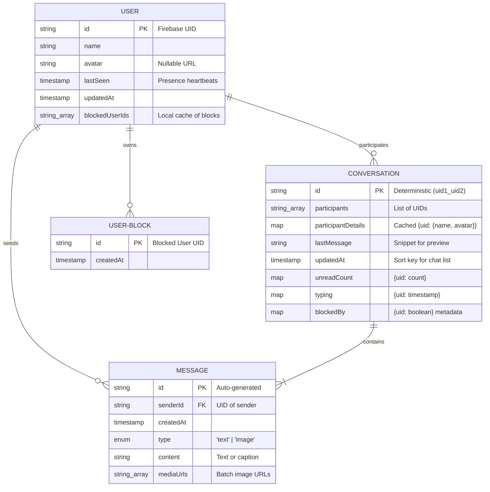

# Chat Feature Architecture

The Chat feature provides real-time messaging between Users (Artists, Galleries, and Collectors) using Firebase Firestore. It follows the vertical feature slice pattern located in `src/features/chat/`.

## 🏗️ Architecture

- **Pillar**: 2 (Feature Muscles)
- **Backend**: Firebase Firestore (NoSQL)
- **Real-time**: Handled via `onSnapshot` listeners in React hooks.
- **Identity**: Linked to the application's Firebase Authentication state.

### 📊 Data Model (ERD)



### Directory Structure
- `components/`: UI components including the window, list, input, messages, and the global `mini-chat.tsx`.
- `hooks/`: Specialized listeners for conversations, messages, and typing indicators.
- `pages/`: The top-level composition page.
- `types.ts`: Domain-specific types for messages and conversations.
- `store.ts`: Global state management for the mini-chat widget.

## 🔃 Data Flow

1. **Initiation**: Chats can be initiated by navigating to `/chats?userId=[id]&userType=[type]` or via the global `useChatStore`.
2. **Lazy Creation**: Conversations are only saved to Firestore when the first message is sent.
3. **Synchronization**: `useConversations` and `useMessages` maintain a real-time sync with Firestore. 
    - **Optimization**: These listeners now call `unsubscribe()` when the browser tab is hidden and re-sync automatically upon focus. This significantly reduces Firestore read billing for background tabs.
4. **Pagination**: Messages are fetched in batches (default: 10) starting from the most recent. This is managed via `useMessages` by increasing the Firestore `limit()` on-demand.
5. **Infinite Scroll**: The `ChatMessages` component implements an automated pagination trigger using an `IntersectionObserver`.
6. **Grouped Media Gallery**:
    *   **Architecture**: Images are sent as a batch in a single message document using the `mediaUrls: string[]` field.
    *   **Normalization**: The `useMessages` hook includes a self-healing normalization layer that automatically converts legacy single `mediaUrl` strings into the new plural format. This ensures 100% backward compatibility for all historical chat data.
    *   **Limits**: Enforces a **10-image limit** per batch to maintain Firestore performance and UI responsiveness.
7. **Data Synchronization**: 
    - **Mirroring**: User profiles are mirrored to a Firestore `/users` collection on every login and profile update.
    - **Presence Tracking**: A global loop (`usePresence`) updates the current user's `lastSeen` timestamp in Firestore every 60 seconds.
    - **Optimization**: The presence heartbeat pauses when the tab is hidden and is **throttled** to a maximum of one write per minute to prevent abuse from rapid tab switching.
    - **Online Status**: Real-time status (Active now vs Last seen) is determined via `useUserStatus` hook with a 3-minute activity threshold.
    - **Logout Sync**: Explicitly sets `lastSeen` to the past on logout for immediate offline appearance across devices.
    - **Retroactive Sync**: Updating a profile in Settings automatically triggers a batch update for the current user's entry in their top 50 most recent conversations.
    - **Self-Healing**: Every message sent refreshes the sender's metadata in the conversation to ensure long-term consistency.
8. **Unread Tracking**:
    - **Logic**: A `runTransaction` in `useSendMessage` atomically increments the `unreadCount` Map for participants.
    - **Resolution**: The `useMarkRead` hook resets the count and cleans up legacy fields.
9. **Search Logic**: Local, client-side filtering of conversations for instant results without database round-trips.
10. **Hybrid Blocking**:
    - **Architecture**: Separates private block lists (`/users/{uid}/blocks/`) from conversation-level metadata (`blockedBy` mapping).
    - **Instant Sync**: The `useBlockUser` and `useUnblockUser` mutations immediately update the deterministic conversation document's `blockedBy` mapping to ensure zero-lag enforcement.
    - **Self-Healing**: The `useChatSecurity` hook runs when a chat window opens, cross-referencing the Backend API status with Firestore to repair any metadata inconsistencies.
11. **Typing Indicators**:
    - **Throttling**: The `useTypingIndicator` hook throttles Firestore writes to once every 2 seconds to minimize database overhead.
    - **Resilience**: Uses a `Timestamp` based model. The recipient validates the age of the indicator (clears after 5s), ensuring no "stuck" indicators if a user disconnects abruptly.
    - **Auto-stop**: Automatically clears the status after 3 seconds of inactivity or upon sending a message.

## 🔔 Push Notifications (FCM)

The application implements a cross-platform push notification system using **Firebase Cloud Messaging (FCM)**.

### 🏗️ Architecture (API Bridge)

To maintain a zero-cost deployment (avoiding Firebase Blaze plan requirements for Cloud Functions), notifications are triggered via a **Next.js API Bridge**:
1. **Message Sent**: `useSendMessage` hook persists the message to Firestore.
2. **API Trigger**: A background `fetch` is sent to `/api/chat/notify`.
3. **Admin SDK**: The API route uses the `firebase-admin` SDK to securely send notifications to all registered devices of the recipient.

### 🛠️ Implementation Details

- **Data-Only Payloads**: We use "Data-Only" FCM payloads. This prevents the browser from showing generic notifications and gives our **Service Worker** full control over how the notification looks (with app branding and correct navigation).
- **Dynamic Service Worker**: The Service Worker is served via a dynamic Route Handler (`src/app/firebase-messaging-sw.js/route.ts`). This allows us to inject environment variables (`FIREBASE_API_KEY`, etc.) at runtime without hardcoding them in the `public/` folder.
- **Token Sync**: The `useFcm` hook manages browser permissions and automatically synchronizes FCM tokens to the user's Firestore document under `/users/{uid}/fcmTokens`.
- **Self-Healing**: Invalid or expired tokens are automatically detected and pruned by the API route to ensure delivery efficiency.

### 📍 Navigation & UI

- **Deep Linking**: Notifications are interactive. Clicking a background notification automatically navigates the user to the correct conversation thread (`/chats?id=...`) and focuses the browser tab.
- **Foreground Toasts**: If the user is actively using the app, push notifications are suppressed in favor of high-performance **Sonner Toasts** for a less intrusive experience.
- **Sidebar Indicator**: The "Messages" navigation item in the sidebar features a **pulsing red indicator** (`useUnreadCount`) that appears globally whenever the user has unread messages, even if they aren't on the chat page.
- **PWA App Badging**: The system implements the **W3C Badging API** to show a numeric count on the application icon (mobile home screen or desktop taskbar). 
    - **Sync Logic**: `useUnreadCount` automatically synchronizes the Firestore unread count to the app badge when the app is active.
    - **Background Updates**: The Service Worker updates the badge dynamically when a background message arrives, ensuring the badge remains accurate even if the app is closed.

## 🧩 Global Mini-Chat Widget

The application features a floating **Mini-Chat Widget** (`MiniChat`) that persists across all protected dashboard routes, allowing users to communicate without leaving their current page.

- **Drill-Down Navigation**: Supports a multi-chat flow where users can navigate between a global conversation list and individual chat windows within the same widget.
- **Smart Visibility**: The widget automatically hides itself when the user is on the main `/chats` page to avoid UI redundancy.
- **Responsive Design**: Uses a glassmorphism aesthetic with `backdrop-blur`. It implements a dynamic `max-height` constraint (`calc(100vh - 100px)`) to ensure the control buttons (close/minimize) remain accessible on small viewports.
- **Adaptive Variant**: Components like `ChatHeader` and `ChatWindow` detect the `mini` variant to adjust their layout (e.g., adding a "Back" button to return to the list).

## 📦 State Management (Zustand)

Global chat state is centralized in `src/features/chat/store.ts` using **Zustand**.

- **Persistence**: The state (active conversation, visibility, minimized status) is persisted in `localStorage` using the `persist` middleware. This allows chat windows to remain open and active even after a page refresh.
- **Atomic Actions**:
    - `openConversation(id)`: Immediately switches the widget to a specific chat and maximizes it.
    - `setShowList(true)`: Triggers the drill-down "Back" behavior to show the conversation list.
    - `closeChat()`: Resets the state and hides the widget.

## 🎨 UI & UX Patterns

- **Conversation Discovery**: High-speed local search implemented in the `ChatList` header using a togglable `Input` field. It filters by participant names in real-time.
- **Visual Anchoring**: The chat list uses `flex-col-reverse` to natively anchor the scroll to the bottom. This ensures that any new messages appear at the bottom without requiring manual programmatic scrolling.
- **Message Bubbles**: Uses a modern rounded design (`rounded-2xl`) with directional "tails" (`rounded-tr-none` for sender, `rounded-tl-none` for receiver) to provide clear visual orientation.
- **Vertical Rhythm**: A `gap-y-3` is maintained between messages in the `ChatMessages` container to improve readability and prevent visual clutter.
- **Smart Loading**: During pagination, the chat list stays mounted. This prevents scroll position resets and ensures a flicker-free experience when loading older messages.
- **Auto-Correction**: If the initial load of 10 messages doesn't fill the entire viewport, the system detects the visible "load more" sentinel and immediately fetches additional batches until the screen is full.
- **Grouped Media Gallery**: 
    - **Smart Grid**: Automatically adapts its layout based on the image count (1, 2, 3, or 4+ images). Uses a custom collage layout for 3-image batches to highlight the first piece.
    - **Overflow Logic**: Batches larger than 4 images display a blurred **"+X"** overlay on the 4th thumbnail to maintain a compact vertical rhythm.
- **Media Lightbox Viewer**:
    - **Experience**: Clicking any gallery image opens a full-screen, high-resolution viewer with a dark overlay.
    - **Navigation**: Supports keyboard arrows (Left/Right/Esc), mobile tap zones, and a persistent thumbnail strip for rapid navigation within a batch.
- **Unread Awareness**: 
    - Unread conversations are visually anchored in the `ChatList` using **bold text** for the participant name and the **Primary color** for the last message snippet.
    - A count badge indicates precisely how many messages are waiting.
    - These indicators clear automatically when the chat window becomes active or when new messages arrive while the window is focused.
- **Live Feedback**:
    - The `ChatHeader` displays an animated "**Typing...**" pulse when the other participant is active, providing immediate social presence feedback.
- **Contextual Discovery (Profile Preview)**: 
    - Clicking the `ChatHeader` (participant name or avatar) opens a slide-out **Profile Preview Sheet**.
    - **Purpose**: Allows users to verify biographies, about sections, and featured works without losing conversation context.
    - **Navigation**: Includes a "View Full Profile" button for deep exploration.
    - **Smart Logic**: The "View Full Profile" link is automatically hidden for **BUYER** account types, as they lack public detail pages, maintaining interface integrity.
    - **Accessibility**: Implements visually hidden `SheetTitle` and `SheetDescription` to comply with ARIA requirements while maintaining a minimal visual aesthetic.

## 🔐 Security & Operations

### [firestore.rules](file:///d:/data/learning/work/real-work/art-space-next/firebase/firestore.rules)
Production-grade security rules. 
- **Conversations**: 
  - **Create**: Restricted to participants; verified against private block lists via `exists()` to prevent unauthorized initiation.
  - **Read/Update**: Restricted to participants only.
- **Messages**: 
  - **Create**: Verified against the parent conversation's `blockedBy` metadata for "Zero-Cost" instant enforcement.
- **Blocks**:
  - **Read/Write**: Strictly owner-only to preserve user privacy.
- **Users**: 
  - **Read**: Any authenticated user can read public profiles (needed for presence status).
  - **Write**: Restricted to the owner (`request.auth.uid == userId`) for profile mirroring and presence updates.
- **Validation**: Ensures only legitimate participants can be added.

### Deployment
Infrastructure changes (rules/indexes) must be synced using:
```bash
npm run deploy:firebase
```

## 🚩 Feature Flag
Controlled by `NEXT_PUBLIC_FEATURE_CHAT_ENABLE` in [src/config/env.ts](file:///d:/data/learning/work/real-work/art-space-next/src/config/env.ts).
- When `false`: Hides sidebar links, "Send Message" buttons, and protects the `/chats` route.

## 🗺️ Path Configuration
The Chat route is configured in `paths` as `paths.chats`.

---

> [!NOTE]
> When testing locally, ensure your `.env` has a valid Firebase configuration and the feature flag is enabled.
